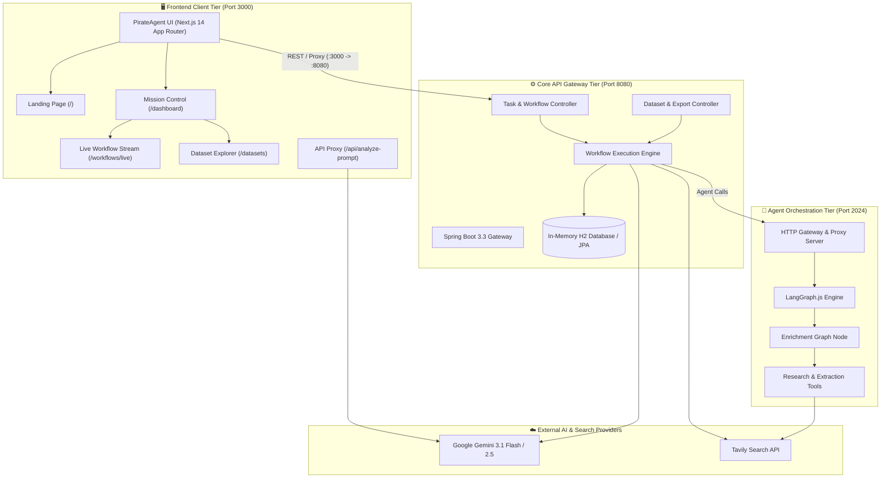
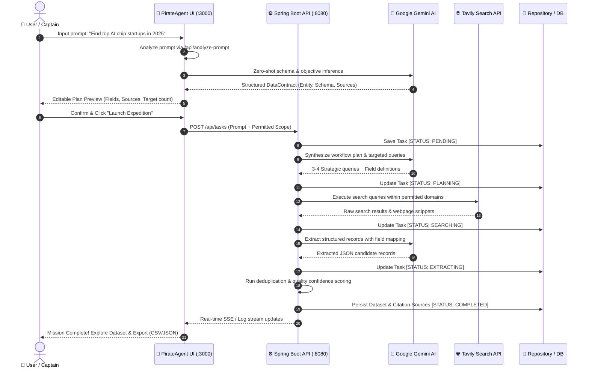
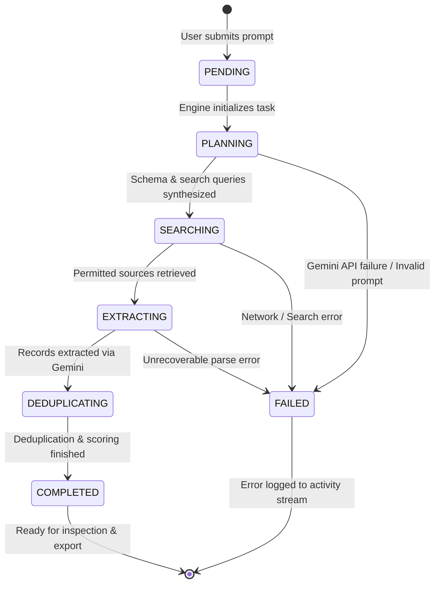

# 🏴‍☠️ PirateAgent — Autonomous AI Data Intelligence Platform

[](https://nextjs.org/)
[](https://spring.io/projects/spring-boot)
[](https://www.oracle.com/java/)
[](https://langchain-ai.github.io/langgraphjs/)
[](https://ai.google.dev/)
[](https://tavily.com/)
[](https://tailwindcss.com/)
[](https://www.typescriptlang.org/)
[](LICENSE)

> **PirateAgent** is an enterprise-grade autonomous data intelligence and web extraction platform. Powered by Google Gemini AI, LangGraph multi-agent workflows, and a Spring Boot + Next.js architecture, PirateAgent translates natural language prompts into verified, structured datasets with verifiable web source citations, deduplication, quality scoring, and multi-format exports.

---

## 📑 Table of Contents

- [Overview](#-overview)
- [System Architecture](#-system-architecture)
- [Workflow & Pipeline Flow](#-workflow--pipeline-flow)
- [State Machine & Task Lifecycle](#-state-machine--task-lifecycle)
- [Tech Stack](#-tech-stack)
- [Key Features](#-key-features)
- [Repository Structure](#-repository-structure)
- [Getting Started](#-getting-started)
  - [Prerequisites](#prerequisites)
  - [Environment Configuration](#environment-configuration)
  - [Running the Services](#running-the-services)
- [API Reference](#-api-reference)
- [Branch Protection Guide](#-branch-protection-guide)
- [License](#-license)

---

## 🔭 Overview

Traditional web scraping requires brittle selector maintenance, custom regex, and rigid schema setups. **PirateAgent** eliminates this complexity through autonomous multi-agent coordination:

1. **Natural Language Understanding**: A business user types an objective in plain English (e.g., *"Find all B2B cybersecurity SaaS startups in Europe with Series A funding in 2025"*).
2. **Dynamic Schema & Strategy Synthesis**: The platform's AI reasoning engine extracts the target entity, generates a strongly-typed schema, creates search queries, and establishes permitted source scopes.
3. **Autonomous Web Discovery & Extraction**: Targeted searches retrieve authorized source documents, extract structured records, and validate fields.
4. **Data Hygiene & Provenance**: Deduplication, quality confidence scoring, and source attribution are performed before structuring the final dataset.
5. **Exploration & Export**: Results are browsable through an interactive UI with pagination, sorting, search, and one-click CSV / JSON export.

---

## 🏛 System Architecture

The following diagram illustrates the three-tier microservice architecture powering PirateAgent:



---

## 🔄 Workflow & Pipeline Flow

The sequence below details how a plain-English request is synthesized into a verified dataset:



---

## 📊 State Machine & Task Lifecycle

Every research mission follows a deterministic state machine managed by the backend engine:



---

## 🛠 Tech Stack

### Frontend Application (`PirateAgentUI`)
| Technology | Version | Purpose |
|---|---|---|
| **Next.js** | 14.2.x (App Router) | React server components, static generation, dynamic API routes |
| **React** | 18.3.x | Client-side reactive UI components and hooks |
| **TypeScript** | 5.x | End-to-end type safety across contracts, entities, and responses |
| **Tailwind CSS** | 3.4.x | Design token utility system supporting warm parchment and dark ocean palettes |
| **Lucide Icons** | 0.446.x | Clean interface iconography |
| **Custom SVG Icons** | — | Pirate-themed nautical assets (Compass, Spyglass, ShipWheel, TreasureChest, etc.) |

### Backend API Server (`backend`)
| Technology | Version | Purpose |
|---|---|---|
| **Java** | 21 (LTS) | Modern Java runtime with virtual threads and pattern matching |
| **Spring Boot** | 3.3.4 | Core REST API gateway, dependency injection, embedded Tomcat |
| **Spring Data JPA** | 3.3.4 | Object-relational mapping and repository abstraction |
| **Hibernate ORM** | 6.5.x | Persistence layer management and schema generation |
| **H2 Database** | 2.x | High-speed in-memory database with `/h2-console` inspector |
| **HikariCP** | 5.1.x | High-performance JDBC connection pooling |
| **Jackson** | 2.17.x | High-throughput JSON serialization, streaming, and schema binding |
| **Apache Maven** | 3.9+ | Multi-phase build, packaging, and dependency management |

### Agentic Intelligence & Orchestration
| Technology | Version | Purpose |
|---|---|---|
| **LangGraph.js** | 1.4+ | Multi-agent state graph orchestration, looping, and human-in-the-loop nodes |
| **LangChain Core** | 1.2+ | Standardized LLM primitives, prompts, and runnables |
| **Google Gemini** | 3.1 Flash / 2.5 | Fast structured JSON output, zero-shot entity extraction, and prompt synthesis |
| **Tavily Search** | 1.2+ | Domain-filtered, citation-backed web discovery engine |
| **Node.js / tsx** | 20+ | TypeScript execution environment for agent scripts and gateway |

---

## ✨ Key Features

- **🧠 Zero-Shot Natural Language Prompt Understanding**:
  Type any data request into the prompt studio. Gemini AI automatically determines the entity type, generates schema fields, sets required/optional constraints, and selects permitted sources.
- **⚡ Real-Time Pipeline Stream**:
  Track every operational step live: intent parsing, domain searching, LLM extraction, deduplication, and completion.
- **🛡️ Full Source Attribution & Provenance**:
  Every record links back to its verified web source with domain verification, reliability ratings, and citation snippets.
- **📄 Comprehensive Pagination**:
  Built-in pagination across all dashboard labels (Workflows, Datasets, Sources, History, and Activity) ensures fast load times and clean navigation.
- **🗑️ Delete & Rerun Controls**:
  One-click task and dataset management with spinner feedback and backend synchronization.
- **🌗 Light & Dark Theme Support**:
  Defaults to a warm parchment light mode with a smooth dark ocean theme toggle persisted via `localStorage`.
- **📦 Multi-Format Data Export**:
  Download datasets in CSV and JSON formats with custom file naming and data sanitation.

---

## 📂 Repository Structure

```
PirateAgent/
├── PirateAgentUI/                     # Next.js 14 Frontend Application
│   ├── app/
│   │   ├── (auth)/                    # Login and Signup pages
│   │   ├── api/analyze-prompt/        # Gemini AI prompt analysis API route
│   │   ├── dashboard/                 # Mission Control application pages
│   │   │   ├── activity/              # Live activity feed with pagination
│   │   │   ├── datasets/              # Datasets overview and record tables
│   │   │   ├── history/               # Historical expedition runs and reruns
│   │   │   ├── research/new/          # Mission configuration and prompt analyzer
│   │   │   ├── sources/               # Source reliability and domain explorer
│   │   │   ├── workflows/             # Active and past workflow management
│   │   │   └── settings/              # Captain profile and theme configuration
│   │   ├── layout.tsx                 # Root layout with theme provider
│   │   └── page.tsx                   # Animated PirateAgent landing page
│   ├── components/                    # Modular UI components
│   │   ├── common/                    # Logo, Pagination, ThemeProvider, EmptyState
│   │   ├── dataset/                   # DataTable, ExportMenu, SourceDrawer
│   │   ├── layout/                    # Sidebar, Topbar, NotificationsMenu
│   │   └── icons/                     # Pirate and nautical SVG icon library
│   └── lib/                           # API client, types, mock data, and utilities
│
├── backend/                           # Spring Boot 3.3 Java Backend
│   ├── src/main/java/com/dataintelligence/
│   │   ├── controller/                # REST API controllers
│   │   ├── dto/                       # Data transfer objects
│   │   ├── model/                     # JPA entity definitions
│   │   ├── repository/                # Spring Data JPA repositories
│   │   └── service/                   # WorkflowEngine, GeminiService, ExportService
│   ├── src/main/resources/
│   │   ├── static/                    # Static gateway portal & auto-redirect
│   │   └── application.properties     # Database, server, and API configurations
│   └── pom.xml                        # Maven dependencies and build configuration
│
├── src/enrichment_agent/              # LangGraph.js Agent Graph
│   ├── graph.ts                       # State graph definition and node transitions
│   ├── state.ts                       # Graph state channels and schema types
│   ├── configuration.ts               # Runtime agent configuration
│   └── tools.ts                       # Web search and content extraction tools
│
├── scripts/
│   └── server.ts                      # LangGraph development gateway & proxy server
├── .env.example                       # Example environment variable template
├── package.json                       # Root workspace scripts and dependencies
└── README.md                          # Platform documentation
```

---

## 🚀 Getting Started

### Prerequisites

Ensure you have the following installed on your system:
- **Node.js**: v18.18.0 or higher (v20+ recommended)
- **Java Development Kit (JDK)**: Java 21 LTS
- **Apache Maven**: 3.8+ (or use `./mvnw`)
- **Git**

### Environment Configuration

1. In the repository root, create a `.env` file:
```env
# Tavily Search API Key (Get free key at https://app.tavily.com)
TAVILY_API_KEY=tvly-your-tavily-api-key

# Google Gemini API Key (Get key at https://aistudio.google.com)
GEMINI_API_KEY=your-gemini-api-key
GOOGLE_API_KEY=your-gemini-api-key

# Optional LangSmith Tracing
LANGCHAIN_PROJECT=pirate-agent
```

2. In the `PirateAgentUI/` directory, create a `.env.local` file:
```env
GEMINI_API_KEY=your-gemini-api-key
```

---

### Running the Services

PirateAgent consists of three cooperating services:

#### 1. Start the Spring Boot Backend (Port 8080)
```bash
# Package the Spring Boot JAR (skipping unit tests for fast build)
mvn -f backend/pom.xml package -DskipTests

# Run the packaged executable JAR
java -jar backend/target/ai-data-intelligence-platform-1.0.0.jar
```
*Health Check*: `http://localhost:8080/api/tasks`  
*H2 Console*: `http://localhost:8080/h2-console`

#### 2. Start the LangGraph Agent Engine (Port 2024)
```bash
# In the repository root
yarn install
npx yarn dev
```
*Health Check*: `http://127.0.0.1:2024/ok`  
*Dashboard & Studio Bridge*: `http://127.0.0.1:2024`

#### 3. Start the Next.js Frontend (Port 3000)
```bash
# In the PirateAgentUI directory
cd PirateAgentUI
npm install
npm run dev
```
*Access Application*: [http://localhost:3000](http://localhost:3000)

---

## 📡 API Reference

The Spring Boot backend exposes REST endpoints under `/api`:

| Method | Endpoint | Description |
|---|---|---|
| `POST` | `/api/tasks` | Create and initiate a new data intelligence research task |
| `GET` | `/api/tasks` | Retrieve all active and completed tasks |
| `GET` | `/api/tasks/{id}` | Fetch task execution status, logs, and progress |
| `DELETE` | `/api/tasks/{id}` | Delete a task and its associated dataset |
| `POST` | `/api/tasks/{id}/rerun` | Re-trigger an existing workflow with original parameters |
| `GET` | `/api/tasks/{id}/dataset` | Retrieve structured records and source citations |
| `GET` | `/api/tasks/{id}/export?format={csv\|json}` | Download dataset in CSV or JSON format |
| `GET` | `/api/templates` | Retrieve instant business requirement presets |

### Next.js Internal AI Endpoint:
| Method | Endpoint | Description |
|---|---|---|
| `POST` | `/api/analyze-prompt` | Analyzes arbitrary natural language prompts via Gemini AI |

---

## 🔒 Branch Protection Guide

To protect the `main` branch from accidental force pushes or deletions:

1. Open your repository on GitHub:
   [https://github.com/VishalRajExe/PirateAgent/settings/branches](https://github.com/VishalRajExe/PirateAgent/settings/branches)
2. Click **Add branch protection rule** (or **Add ruleset**).
3. Under **Branch name pattern**, enter:
   ```
   main
   ```
4. Enable the recommended protection options:
   - ✅ **Require a pull request before merging**
   - ✅ **Require status checks to pass before merging**
   - ✅ **Block force pushes** (prevents `git push --force`)
   - ✅ **Prevent branch deletion** (prevents deleting `main`)
5. Click **Save changes** (or **Create**).

---

## 📄 License

This project is licensed under the **MIT License** — see the [LICENSE](LICENSE) file for details.

Developed and maintained with precision by the **PirateAgent Team**.
